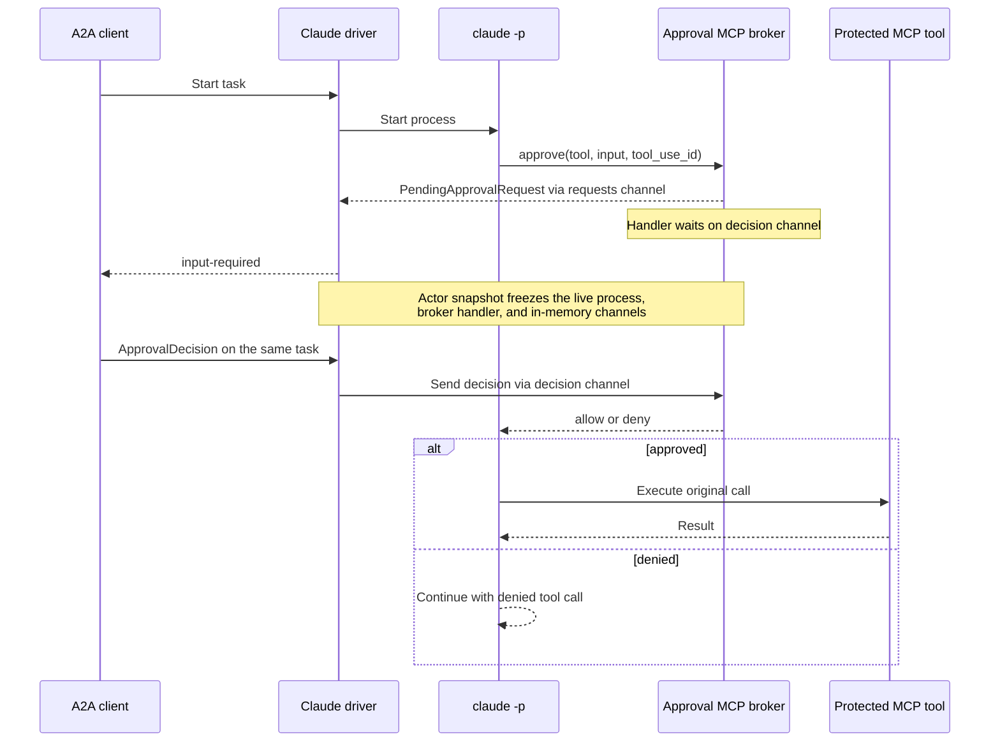

# Claude Harness

The Claude Harness runs Claude Code as a native Kagent runtime. It compiles an
`AgentTemplate` into Claude Code configuration, runs each turn in a Substrate
Actor, and exposes the result through Kagent's A2A API.

## Code structure

The controller and Actor share only the versioned config contract. Kubernetes
resolution stays in the controller; native process behavior stays in this
harness.

| Path | Look here for |
| --- | --- |
| [`../../core/internal/translator/claude`](../../core/internal/translator/claude) | Translating `Harness`, `AgentTemplate`, model, MCP, plugin, and Secret inputs into a runtime revision and warnings |
| [`config/config.go`](config/config.go) | The versioned JSON contract shared by the compiler and runtime, including defaults and reserved environment variables |
| [`cmd/main.go`](cmd/main.go) | Actor startup, environment inputs, Claude version validation, continuation-store wiring, and private A2A startup |
| [`internal/adapter/adapter.go`](internal/adapter/adapter.go) | Materializing Claude home, skills, MCP config, and ephemeral provider credentials |
| [`internal/driver`](internal/driver) | Claude CLI arguments, stream-JSON parsing, runtime-event translation, cancellation, and process supervision |

## Working

- [x] Anthropic API keys and Amazon Bedrock bearer tokens, injected by the gateway
- [x] Streaming text, tool calls, and tool results over A2A
- [x] Task cancellation
- [x] Durable Claude session resume between turns
- [x] Claude Code built-in tools
- [x] Shared local subagents
- [x] Standalone skills and plugin-provided skills
- [x] Direct HTTP and SSE MCP servers with whole-server tool access
- [x] Human-in-the-loop MCP tool approval

Credentials use [Substrate gateway injection](../../../docs/architecture/credential-injection.md).
AWS IAM keys and Vertex service-account keys require local signing and are rejected
by the compiler. Arbitrary Harness `credentialRef` environment values are also unsupported.

With `KAGENT_PROPAGATE_TOKEN=true` in the Harness environment, the caller's `authorization`
of each A2A turn is forwarded on MCP calls, as the Go ADK does. The adapter points every
compiled streamable HTTP MCP server at a private, authenticated loopback endpoint of the
harness process; that forwarder adds the turn's credential (which wins over a static
`Authorization` header) and the server's compiled headers, and drops the credential before
the turn's outcome is returned, so a parked or suspended Actor holds none. The credential
never enters Claude's environment or `mcp.json`. SSE servers are not fronted: their
message endpoint is announced by the upstream host.

With `KAGENT_CLAUDE_PROJECT_INSTRUCTIONS=true` in the Harness environment, Claude reads the
workspace's `CLAUDE.md` and `AGENTS.md` (`--setting-sources project`): the working directory's
at the start of a turn, a cloned repository's as soon as Claude reads a file in it. Project
settings apply too, under the rendered settings file, which sets `disableAllHooks`, so a
cloned repository runs no hooks. Off (the default), a repository's instructions reach Claude
only when it reads them as files.

## Human-in-the-loop approval flow

Claude runs in print mode with the adapter's rendered settings file as its only
settings source (`--setting-sources ""`): nothing under `CLAUDE_CONFIG_DIR` or the
workspace, which holds whatever the agent cloned, adds hooks or permissions to a
turn. That file carries `permissions.ask` rules for MCP servers that require approval. Its native `--permission-prompt-tool` calls a private,
authenticated loopback MCP tool before executing a protected call.



The `requests` channel carries a new pending request from the MCP handler to the
process driver. The per-request `decision chan runtime.ApprovalDecision` carries
the response in the other direction. The channel is not durable storage: the
full Actor memory snapshot preserves the live Claude process, blocked handler,
and channel together until the same task resumes. If we want to switch to DATA 
snapshot in the future, we will need to switch to using deferred tool call with 
hooks instead.

See [defer a tool call for later](https://code.claude.com/docs/en/hooks#defer-a-tool-call-for-later).

The `permission-prompt-tool` might not work if you modify the permission rules, 
permission mode, hooks (like `PreToolUse / PermissionRequest`) since they resolve 
the tool calls first before Claude's permission system invoke the `permission-prompt-tool`. 
If this tool does not respond (e.g. error or timeout or failed connection), 
the unresolved requests are denied, not approved.

## Planned / not yet supported

- [ ] Ask User tool (removed upstream, see https://github.com/anthropics/claude-code/issues/77994, would require Agents SDK)
- [ ] Checkpoint and fork continuity for Claude sessions
- [ ] Enforced selection of individual tools from an MCP server
- [ ] Dedicated subagents running in separate AgentInstances
- [ ] Skills, MCP tools, and nested subagents on local subagents
- [ ] Configuring Claude Code permission mode and trust boundary in Harness CRD

## Example usage

```yaml
apiVersion: kagent.dev/v1alpha3
kind: Harness
metadata:
  name: claude-e2e
  namespace: kagent
spec:
  claude: {}
  workload:
    image: ${KAGENT_CLAUDE_IMAGE}
  substrate:
    workerPoolRef:
      name: kagent-default
    snapshotPolicy:
      location: gs://ate-snapshots/kagent/
  allowedAgentTemplates:
    selector:
      matchLabels:
        kagent.dev/e2e-runtime: claude
---
apiVersion: kagent.dev/v1alpha3
kind: AgentTemplate
metadata:
  labels:
    kagent.dev/e2e-runtime: claude
  name: kagent-claude
  namespace: kagent
spec:
  description: test
  modelConfig:
    name: bedrock-claude # Assuming you have created a modelconfig using Bedrock Anthropic
  systemPrompt: |
      Follow the selected skill and use the configured MCP tool.
  tools:
    - mcp:
        server:
          kind: RemoteMCPServer
          name: kagent-tool-server
  plugins:
    - source:
        git:
          url: https://github.com/agentplugins/agent-plugins-example.git
          commit: 5f3f5084a821aefa792e79500dd8f0462ab83473
      skills:
        - migrate-agent-plugin
```
