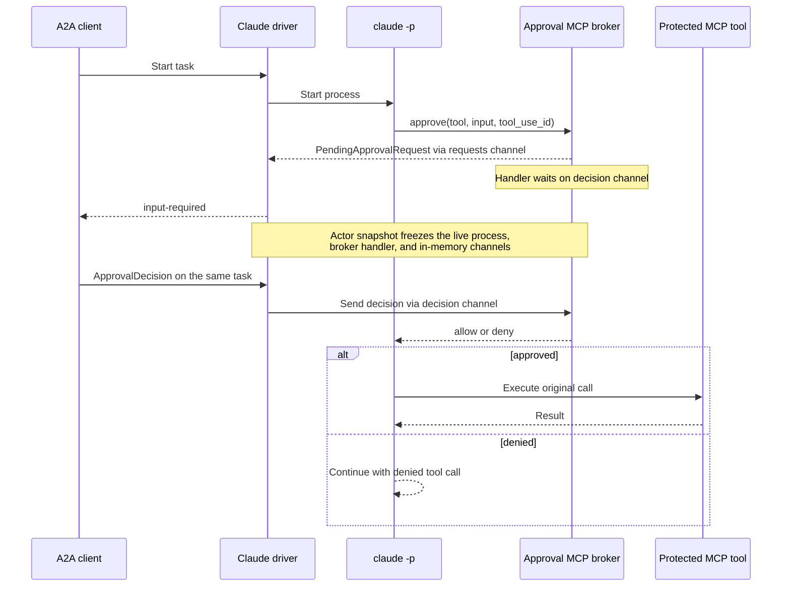

# Claude Harness

The Claude Harness runs Claude Code as a native Kagent runtime. It compiles an
`AgentTemplate` into Claude Code configuration, runs each turn in a Substrate
Actor, and exposes the result through Kagent's A2A API.

## Code structure

The controller and Actor share only the versioned config contract. Kubernetes
resolution stays in the controller; native process behavior stays in this
harness.

| Path | Look here for |
| --- | --- |
| [`../../core/internal/translator/claude`](../../core/internal/translator/claude) | Translating `Harness`, `AgentTemplate`, model, MCP, plugin, and Secret inputs into a runtime revision and warnings |
| [`config/config.go`](config/config.go) | The versioned JSON contract shared by the compiler and runtime, including defaults and reserved environment variables |
| [`cmd/main.go`](cmd/main.go) | Actor startup, environment inputs, Claude version validation, continuation-store wiring, and private A2A startup |
| [`internal/adapter/adapter.go`](internal/adapter/adapter.go) | Materializing Claude home, skills, permission rules, MCP config and provider credentials, and handing Claude's trees to the unprivileged user |
| [`internal/driver`](internal/driver) | Claude CLI arguments, stream-JSON parsing, runtime-event translation, cancellation, and process supervision |

## Working

- [x] Anthropic API keys and Amazon Bedrock bearer tokens, injected by the gateway
- [x] Streaming text, tool calls, and tool results over A2A
- [x] Task cancellation
- [x] Durable Claude session resume between turns
- [x] Claude Code built-in tools
- [x] Shared local subagents
- [x] Standalone skills and plugin-provided skills
- [x] Direct HTTP and SSE MCP servers with whole-server tool access
- [x] Human-in-the-loop MCP tool approval

Credentials use [Substrate gateway injection](../../../docs/architecture/credential-injection.md).
AWS IAM keys and Vertex service-account keys require local signing and are rejected
by the compiler. Harness environment entries accept only literal values.

With `KAGENT_PROPAGATE_TOKEN=true` in the Harness environment, the caller's `authorization`
of each A2A turn is forwarded on MCP calls, as the Go ADK does. The adapter points every
compiled streamable HTTP MCP server at a private, authenticated loopback endpoint of the
harness process; that forwarder adds the turn's credential (which wins over a static
`Authorization` header) and the server's compiled headers, and drops the credential before
the turn's outcome is returned, so a parked or suspended Actor holds none. The credential
never enters Claude's environment or `mcp.json`. SSE servers are not fronted: their
message endpoint is announced by the upstream host. A request whose path holds a `.` or `..`
segment, decoded or not, an encoded slash or backslash, an encoded `%`, a `;` or a control
byte is refused with 400 before it is matched to a server, since the forwarded path is joined
onto the server's URL. Of Claude's request headers, only those the streamable HTTP transport
and trace propagation use reach the server (`Accept`, `Content-Type`, `Mcp-Session-Id`,
`Mcp-Protocol-Version`, `Last-Event-ID`, `User-Agent`, `traceparent`, `tracestate`, `baggage`).

## Users

The image runs the harness as root. On every start the harness hands the workspace and
`/data/claude` to the image's `kagent` user (uid 65532) and starts Claude Code as that
user with no supplementary groups, so Claude and every process it starts can read
neither the harness process, which holds the turn's credential, nor the harness's own
state. The claude translator asks Substrate for `CHOWN`, `SETGID` and `SETUID` on top of
its defaults; no `DAC_*` capability is needed.

A start trusts nothing Claude could have written before it. The harness first takes
`/data` and everything in it other than Claude's two trees back, removing every link
and clearing group and other write, which also covers a volume an earlier image ran as
uid 65532. It then rebuilds `/data/generated` (the skill and plugin packages and the
skills Claude loads) as root and leaves it readable by the `kagent` group only. Of
Claude's trees it touches only the two root directories and never walks their
contents, so links, setuid bits or depth Claude leaves there neither reach the harness
nor fail a start, and Claude's files stay as Claude left them.

What the harness writes for Claude to obey is root-owned and readable by the `kagent`
group only (`0640` in a `0750` directory), so Claude can read it but neither edit,
replace nor add to it: the permission rules in Claude Code's managed settings
(`/etc/claude-code/managed-settings.json`, which the harness owns: an operator file
mounted there is replaced), and `mcp.json` and the Google credentials in
`/run/kagent-claude`.

This does not make approval a boundary against Claude. `mcp.json` must be readable for
Claude to reach its servers, so a process Claude starts can call the forwarder or the
approval broker with the same loopback token, and a hook in Claude's own settings can
answer a permission prompt. Approval of a protected tool is enforced by the MCP server.

`KAGENT_PROPAGATE_TOKEN=true` with MCP servers requires the root harness: a harness
that runs as another user would start Claude Code as itself, and it refuses to start.
A harness without the forwarder may run as any user; Claude Code then runs as the same
user, and the settings, `mcp.json` and Google credentials are owner-only files in
`/tmp/kagent-claude`.

## Telemetry

The driver passes each prompt to Claude Code on stdin as stream-JSON. When
Claude Code telemetry is on, it holds the prompt until that telemetry has
initialized. Claude Code starts a turn without waiting for its telemetry, and
with first-party Anthropic credentials that initialization first waits on a
managed settings fetch. A turn that starts earlier drops its spans, events and
metrics, and ignores `TRACEPARENT`. The driver therefore adds a loopback
Prometheus metrics reader and sends the prompt once `claude_code.session.count`
appears there, which Claude Code increments only after its providers are
registered. That ordering is a Claude Code implementation detail, verified on
2.1.260 and 2.1.282.

The wait is bounded at 10 seconds, so a stalled settings fetch delays a turn by
at most that much. The driver then sends the prompt and records a
`kagent.claude.telemetry_not_ready` event on the turn's `invoke_agent` span, as
it also does when it cannot reserve the loopback port. Claude Code stops waiting
for the fetch after 30 seconds, so in a turn that runs past then, spans started
after its telemetry initializes become roots of new traces rather than being
absent.

## Human-in-the-loop approval flow

Claude runs in print mode with `permissions.ask` rules for MCP servers
that require approval. A root harness renders them as managed settings with
`allowManagedPermissionRulesOnly`, on every start, so no user, project or workspace
rule applies; otherwise the driver passes them with `--settings`, and user and project
`allow` rules do not skip an `ask`. Skills under `--add-dir` and `CLAUDE.md` load either
way. Its native `--permission-prompt-tool` calls a private,
authenticated loopback MCP tool before executing a protected call.


```mermaid
sequenceDiagram
    participant Client as A2A client
    participant Driver as Claude driver
    participant Claude as claude -p
    participant Broker as Approval MCP broker
    participant Tool as Protected MCP tool

    Client->>Driver: Start task
    Driver->>Claude: Start process
    Claude->>Broker: approve(tool, input, tool_use_id)
    Broker-->>Driver: PendingApprovalRequest via requests channel
    Note over Broker: Handler waits on decision channel
    Driver-->>Client: input-required
    Note over Driver,Broker: Actor snapshot freezes the live process,<br/>broker handler, and in-memory channels
    Client->>Driver: ApprovalDecision on the same task
    Driver->>Broker: Send decision via decision channel
    Broker-->>Claude: allow or deny
    alt approved
        Claude->>Tool: Execute original call
        Tool-->>Claude: Result
    else denied
        Claude-->>Claude: Continue with denied tool call
    end
```

The `requests` channel carries a new pending request from the MCP handler to the
process driver. The per-request `decision chan runtime.ApprovalDecision` carries
the response in the other direction. The channel is not durable storage: the
full Actor memory snapshot preserves the live Claude process, blocked handler,
and channel together until the same task resumes. If we want to switch to DATA
snapshot in the future, we will need to switch to using deferred tool call with
hooks instead.

See [defer a tool call for later](https://code.claude.com/docs/en/hooks#defer-a-tool-call-for-later).

The `permission-prompt-tool` might not work if you modify the permission rules,
permission mode, hooks (like `PreToolUse / PermissionRequest`) since they resolve
the tool calls first before Claude's permission system invoke the `permission-prompt-tool`.
If this tool does not respond (e.g. error or timeout or failed connection),
the unresolved requests are denied, not approved.

## Planned / not yet supported

- [ ] Ask User tool (removed upstream, see https://github.com/anthropics/claude-code/issues/77994, would require Agents SDK)
- [ ] Checkpoint and fork continuity for Claude sessions
- [ ] Enforced selection of individual tools from an MCP server
- [ ] Dedicated subagents running in separate Sessions
- [ ] Skills, MCP tools, and nested subagents on local subagents
- [ ] Configuring Claude Code permission mode and trust boundary in Harness CRD

## Example usage

One `Agent` holds both the template and Harness inline. The referenced ModelConfig
and RemoteMCPServer must already exist in `kagent`. Replace `${KAGENT_CLAUDE_IMAGE}`
with the full harness image reference, including its `@sha256:` digest.

```yaml
apiVersion: api.kagent.dev/v1alpha3
kind: Agent
metadata:
  name: kagent-claude
  namespace: kagent
spec:
  template:
    description: test
    modelConfig:
      name: bedrock-claude # Assuming you have created a modelconfig using Bedrock Anthropic
    systemPrompt: |
        Follow the selected skill and use the configured MCP tool.
    tools:
      - mcp:
          server:
            kind: RemoteMCPServer
            name: kagent-tool-server
    plugins:
      - source:
          git:
            url: https://github.com/agentplugins/agent-plugins-example.git
            commit: 5f3f5084a821aefa792e79500dd8f0462ab83473
        skills:
          - migrate-agent-plugin
  harness:
    claude: {}
    workload:
      image: ${KAGENT_CLAUDE_IMAGE}
    substrate:
      workerPoolRef:
        name: kagent-default
      snapshotPolicy:
        location: gs://ate-snapshots/kagent/
```
